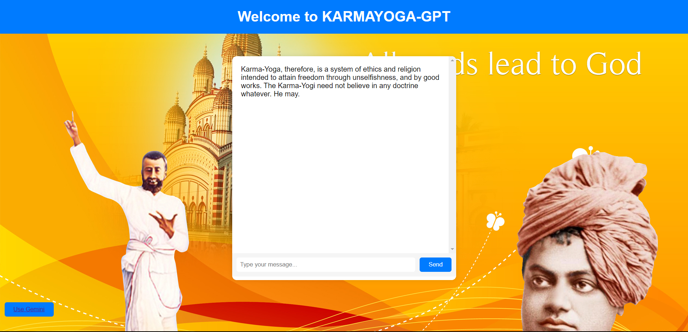
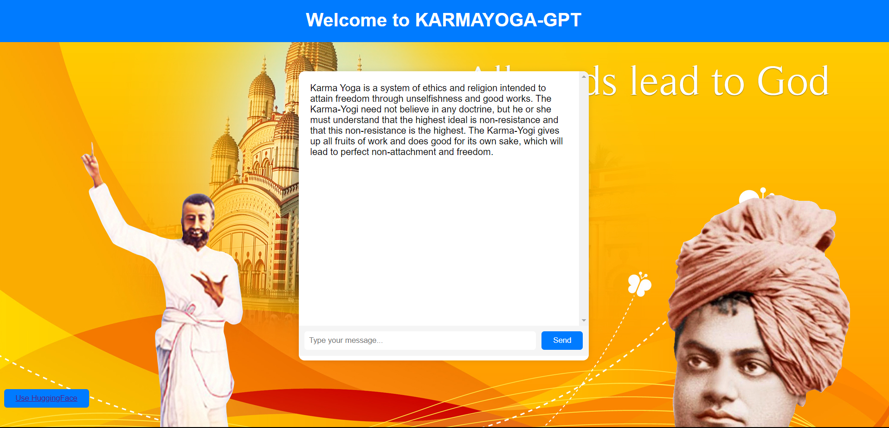

The project is a Langchain based project. The project is entirely built on open-source
softwares. So, long live open-source. You just need a HuggingFace api key and keep it in '.env' file as
HUGGINGFACEHUB_API_TOKEN = "<YOUR KEY>"
## Hugging face Reply to `"What is Karma Yoga"`

## Gemini's response  to `"What is Karma Yoga"`
